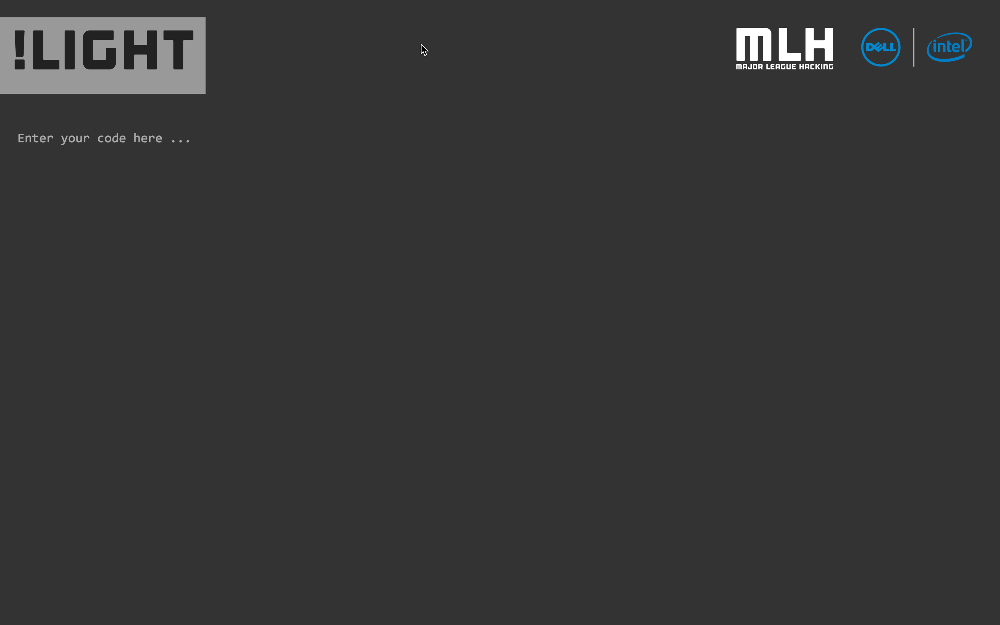
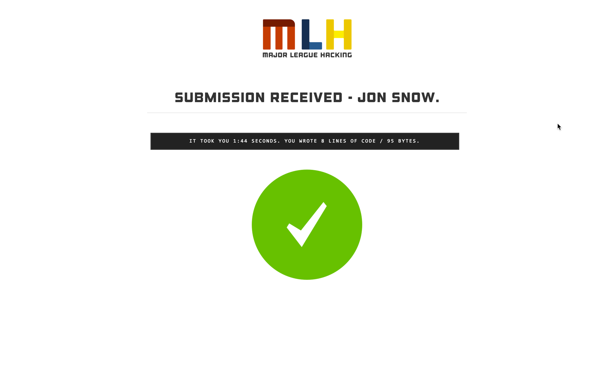

<center></center>

[](https://circleci.com/gh/MLH/no-light/tree/master) 

<br>
This is a **micro service** that allows participants of the No Light mini-event to quickly submit their entries (see below for more info). The organizer of the mini-event can then conveniently download a ZIP file of all the entries.

<center>
	
	
</center>

## FAQ

### What is No Light?

No Light is a mini-event that [Major League Hacking](http://mlh.io) organizes at our hackathons in North America & Europe. Using a really basic code editor, students have 15-20 minutes to replicate a webpage with no previews along the way.

<br>
### How do I setup my own version of No Light?

Firstly, you will want to [fork the repository](http://github.com/bih/no-light). You can deploy this on a service like [Heroku](http://heroku.com) with the following configuration: Ruby 1.9.3 and a MongoDB instance.

A few don't:

- Please **do not** use the Outage font.
- Please **do not** use the Major League Hacking logo, name or trademarks.


```
Setup No Light (on Mac OS X):
$ git clone https://github.com/bih/no-light.git
$ cd no-light
$ bundle install

Setup MongoDB (on Mac OS X):
$ brew install mongodb
$ cd no-light
$ mkdir data && mkdir data/db
$ mongod --dbpath data/db

Launch server locally (on Mac OS X):
$ rackup
```

<br>
### How do I use No Light?

The best way to run through this is through a little story. Here goes.

This story has three characters: Jon, Jane and Sam. Jon is the person moderating No Light. Jane and Sam are both participants.

Jon tells Jane and Sam to go to `http://no-light.mlh.io/whatever-this-event-is-called` and it just works. Jon did no setup beforehand. Jon also shows a website that Jane and Sam need to replicate in 20 minutes.

Bob and Smith visit the URL above and write their code. After 20 minutes, they both submit their code by pressing the big '!light' button. They loved the event though were nervous as to what their webpage looked like.

Jon's excited to show the submissions. He visits the link that was given to Jane and Sam and he added `.zip` to the end (so the link to download the zip is `http://no-light.mlh.io/whatever-this-event-is-called.zip`). He is now given a ZIP file of all the submissions. Amazing.

Jon opens each file and picks one winner through an audience vote.

End of story.

<br>
# Contributing Guidelines

Use the following guides for getting things done, programming well, and
programming in style.

* [Protocol](http://github.com/thoughtbot/guides/blob/master/protocol)
* [Best Practices](http://github.com/thoughtbot/guides/blob/master/best-practices)
* [Style](http://github.com/thoughtbot/guides/blob/master/style)

<br>
# LICENSE

The micro service for No Light is released under the MIT Licence. More information [can be found in LICENSE.md](LICENSE.md).
